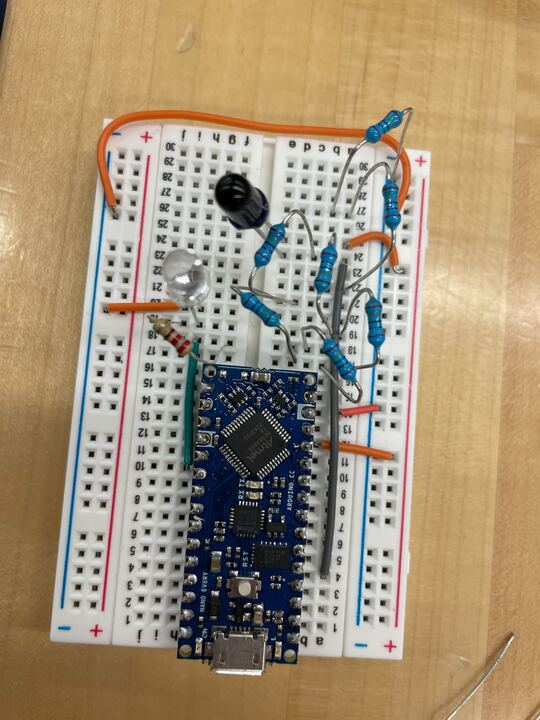

## Arduino code for the [INL-5AMIR15](https://www.digikey.com/en/products/detail/inolux/INL-5AMIR15/10384755) IR emitter and [SFH 4556](https://www.digikey.com/en/products/detail/ams-osram-usa-inc/SFH-4556/2182186) IR receiver

### Wiring example:

