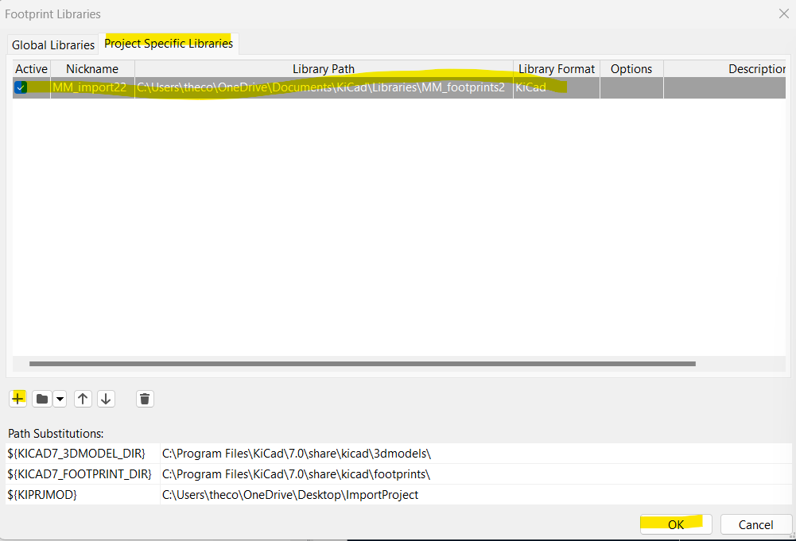

## To Import Schematic Symbol Files

1. Drop the file named MM_Lib.kicad_sym into your project folder with the .kicad_pcb / .kicad_sch files etc

2. In Schematic Editor, go to Preferences > Manage Symbol Libraries. Then add the path to following .kicad_sym file with whatever nickname you want and hit Ok. You will now be able to access the custom Symbols where you find any other symbols via Place > Add Symbol

## To Import Footprint Files (which get attached to the Symbol files in PCB layout)

1. Download all the individual .kicad_mod files and put them in a folder we will call MM_footprint_imports. Move this folder to Documents/KiCad/Libraries (this is not your project folder but the KiCad folder in your main documents directory or wherever you saved it.)

2. In Footprint Editor, go to Preferences > Manage Footprint Libraries and then the Project Specific Libraries tab. Add a new library with path to the MM_footprint_imports (mine is called MM_footprints2) and whatever nickname you want.

You can now associate the symbols you imported above with the footprint files to reference in PCB layout.
